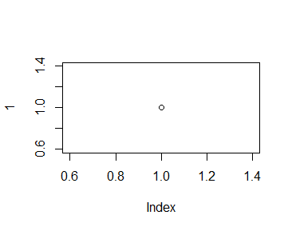

```{r pacotes, include=FALSE}
 if(!require("vegan")) install.packages("vegan")
 if (!require("knitr")) install.packages("knitr")

```
<!-- https://github.com/citation-style-language/styles -->

# Filiacao

# Resumo

# Intro



~~Eu~~ adoro *bolo* de **chocolate**

H~2~O

nome^2^

- Item 1
  - Item 1.1

- Item 2

- Item 3

1. Item
  - Item nao sei o numero

2. Item

# M&M

## Coleta de dados

## Analise de dados


A tabela *mtcars* tem `r nrow(mtcars)` linhas. 

```{r, echo=FALSE, eval=TRUE}
data("mtcars")
kable(mtcars)
```


```{r, echo=FALSE, eval=TRUE, results='asis'}
data("mtcars")

summary(lm(mpg ~ carb, mtcars))
```


# Resultados

A cerquinha abaixo nao mostra o codigo nem o resultado dele

```{r cerquinha do plot, echo=FALSE, eval=FALSE}
plot(1)
```

A cerquinha abaixo mostra o codigo mas nao o resultado

```{r, echo=TRUE, eval=FALSE}
plot(1)

```

A crequinha abaixo mostra o codigo e o resultado dele

```{r, echo=TRUE, eval=TRUE, fig.cap="Meu plot"}
plot(1)

```


# Discussao

Estou citando fulano [@Mcshane2019]

Segundo @Mcshane2019, isso pode acontecer.

Estou citando varias pessoas que fizeram isso [@Stanley2018; @Mcshane2016].

# Referencias